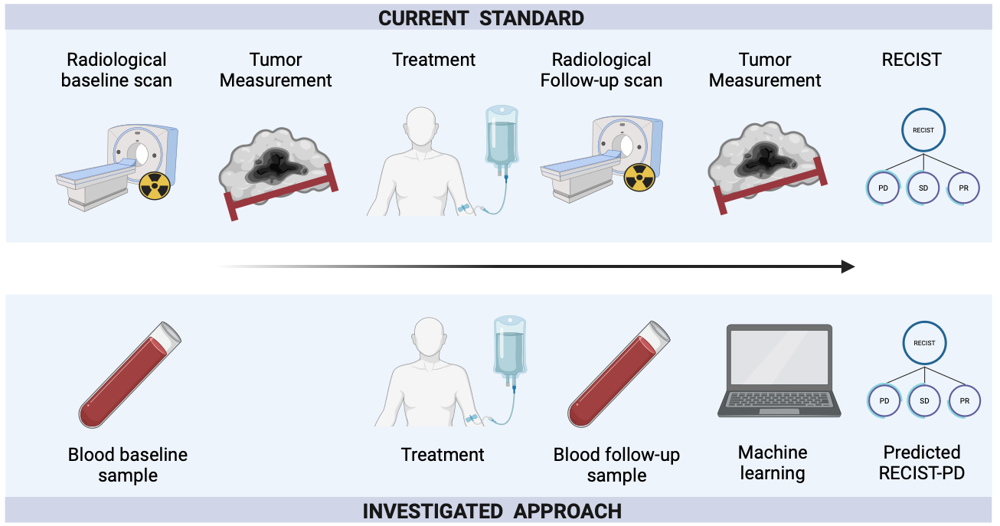

CAN ROUTINE BLOOD-BASED MARKERS PREDICT RECIST PROGRESSION IN NON-SMALL CELL LUNG CANCER TREATED WITH IMMUNOTHERAPY?

The repository contains the code of the paper ['Can routine blood markers predict RECIST progression in non-small cell lung cancer treated with immunotherapy?'](https://doi.org/10.1007/s00432-024-05814-2), published in the Journal of Cancer Research and Clinical Oncology.

The conda environment can be created using the provided environment.yml file using the command:
conda env create --file=environment.yml

For the predictive analysis, use the notebook named PredictiveAnalysis_combined_markers.ipynb in the code folder. For the time-varying regression analysis, use the AssociativeAnalysis_routine_markers.ipynb notebook. The notebooks can be used with routine markers, tumor markers, or combined markers.

